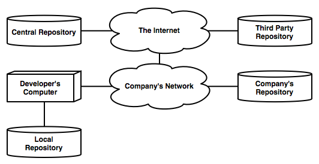

# Introduction

Maven is a tool for building and managing Java applications. Instead of spending time configuring and describing each step of your build processes, Maven uses standard directories and settings  allowing you to concentrate on writing code instead of managing your build process.

It provides a mechanism for defining your project's Dependencies and lets you configure if they are needed at compilation, testing or run time. If the libraries have dependencies themselves, Maven knows to also download these transitive dependencies for your project.

A large number of Plugins are available to use for special building, reporting and other tasks. These Plugins (as well as your Dependencies) are retrieved from a central Repository as needed, making the initial download and install of Maven very light. Downloaded artifacts are stored in a Local Repository on your computer so they are available for future use. Development teams can set up a Proxy Repository on their local network, bringing often used artifacts closer and saving you bandwidth usage and download time.

Several hundred different Archetypes give you a starting point for your project, setting up common Dependencies and build processes. You can also use your Local and Proxy Repositories to install 3rd party dependencies that are not available in one of the popular public ones.

## Who Is This Book For?

This book is for Java developers who need to use Maven or are curious how it works. It assumes you've already made the decision to use Maven or are working with Maven-based projects. This books is not trying to convince you to use Maven, only telling you how.

If you've used Apache Ant to build your projects, that's great. I've used it too and it works pretty well. Throughout writing this book I've gained an appreciation for Maven and intend to use it on future projects, but convincing your IT department to switch to maven falls outside the scope of the book. Hopefully, though, the information provided will armor you to convince others about the benefits of Maven and how easy it makes things once you learn its conventions and commands.

## How to Read This Book

TK

## What Version of Maven to Use

Maven 2.2.1
 
## How Maven Works

TK 

### Project Object Model

TK

### The Lifecycle Model

TK

### Maven Repositories

TK

### Dependency Management

TK

### Maven Plugins

TK

<!-- PAGE BREAK -->

<!-- PAGE BREAK -->

# Part 1: Getting Started

Maven is powered by a number of Java classes and, thusly, relies on Java being installed. Beyond that, the majority of what it needs to run it will download itself. The installation consists of downloading an archive and extracting it to the location of your choice. You set up a few environment variables, put Maven's `bin` directory on your execution path and you're good to go.

<!-- PAGE BREAK -->

<!-- PAGE BREAK -->

## Task 1: Installing Maven

Maven can be downloaded from http://maven.apache.org/download.html. Currently there are two major versions of Maven that are supported: 2.X and 3.X. In this book we'll be using 2.2.1.

Maven requires its main script `mvn` being in your execution path, an environment variable named `M2_HOME` that points to where you installed Maven and the environment variable `JAVA_HOME` which should point to your Java installation. Maven 2.2.1 requires Java 1.4 or higher and Maven 3.X requires Java ?.?.?. It is suggested you use Java 5 or 6.

<!-- PAGE BREAK -->

### Install Maven 2.2.1 on OS X

After downloading Maven 2.2.1 from http://maven.apache.org/download.html

    tar -zxvf apache-maven-2.2.1.tar.gz
    mv apache-maven-2.2.1 /Users/brian/Applications/

Then edit `~/.profile` and add the following:
    
    export JAVA_HOME=/System/Library/Frameworks/JavaVM.framework/Home
    export M2_HOME=/Users/brian/Applications/apache-maven-2.2.1
    export PATH=$PATH:$M2_HOME/bin

Once you're done editing you can run the following command to immediately execute your profile updates:

    source ~/.profile

To install Maven using MacPorts, do this:

    sudo port install maven

### Install Maven 2.2.1 on Ubuntu

Manually installation of Maven on Ubuntu is similar to the Mac OS X process.

To install Maven using Ubuntu's package manager:

    ???apt-get install maven???

### Install Maven 2.2.1 on Windows

TK

<!-- PAGE BREAK -->

## Task 2: Getting Help with Maven

Once you have Maven installed, most everything you do with it will be done by using the `mvn` command, some options for that command and one or more Goals and/or Phases that you pass in. The `mvn` command itself is actually a small shell script that looks for your Java installation (via the environment variable `JAVA_HOME`), your Maven installation (via `M2_HOME`), and then uses Java to execute Maven's main class along with the options and commands you've sent it.

Simply typing `mvn` by itself will present you information for commonly used build commands. Unfortunately this assumes you already have a Maven project, so it's a little misleading. It does offer up the `--help` (or `-h`) command-line argument for getting usage information.  The `--version` and `-v` options will display the version of Maven you're running:

To get information about plugins, your project's POM and environment settings, Maven uses the `help` plugin. To get information on the `help` plugin itself, use the `help:help` goal.

To get a detailed description on the goals listed by `help:help`, set the `goal` property to the goal you are interested in and add the `detail` property to true. You can set properties by adding `-Dproperty=value` on the command-line.

<!-- PAGE BREAK -->

### Display the version of Maven you're using

    prompt> mvn -v
	Apache Maven 2.2.1 (r801777; 2009-08-06 15:16:01-0400)
	...
	
### Display command-line options for Maven

    prompt> mvn -h
	usage: mvn [options] [<goal(s)>] [<phase(s)>]

	Options:
	 -am,--also-make ...	
     -amd,--also-make-dependents ...
	...

### Get information about the help plugin

	prompt> mvn help:help
	...
	Maven Help Plugin
	  The Maven Help plugin provides goals aimed at helping...
	
	This plugin has 9 goals:

	help:active-profiles
	  Displays a list of the profiles which are currently active for this build.
	...
		
### Get information about a specific help goal

    prompt> mvn help:help -Dgoal=describe -Ddetail=true
    ...
    help:describe
	  Displays a list of the attributes for a Maven Plugin and/or goals (aka Mojo -
	  Maven plain Old Java Object).

	  Available parameters:

	    artifactId
	      The Maven Plugin artifactId to describe.
	...

<!-- PAGE BREAK -->

## Task 3: Getting Help with Maven's Help Plugin

To get information about the plugins and arifacts you want to use with Maven, you can use the `help:describe` goal. This goal has three main forms, triggered by setting different properties. As a reminder, you can set properties using the format `-Dproperty=value` on the command-line.

* To get help with a command, set just the `cmd` property.
* To get help with a specific plugin, set the `plugin` property. It should use the format `groupId:artifactId` for plugins beyond the core Maven plugins.
* To get help with an artifact, set both the `groupId` and `arfitactId` properties.

Additional detail can be requested by setting the `detail` property to `true`.

<!-- PAGE BREAK -->

### Get information about a Command

	prompt> mvn help:describe -Dcmd=install
	...
	[INFO] 'install' is a phase corresponding to this plugin:
	org.apache.maven.plugins:maven-install-plugin:install

	It is a part of the lifecycle for the POM packaging 'jar'. This lifecycle includes the following phases:
	* validate: Not defined
	* initialize: Not defined
	...

### Get information about a Plugin

	prompt> mvn help:describe -Dplugin=archetype
	...
	Name: Maven Archetype Plugin
	Description: Maven Archetype is a set of tools...
	Group Id: org.apache.maven.plugins
	Artifact Id: maven-archetype-plugin
	Version: 2.0
	Goal Prefix: archetype

	This plugin has 9 goals:
	...

### Get detailed information about a specific Goal in a Plugin

    prompt>  mvn help:describe -Dplugin=archetype -Dgoal=generate -Ddetail=true
	...
	archetype:generate
	  Description: Generates a new project from an archetype.
	  Implementation:
	  org.apache.maven.archetype.mojos.CreateProjectFromArchetypeMojo
	  Language: java
	  Before this mojo executes, it will call:
	    Phase: 'generate-sources'

	  Available parameters:

	    archetypeArtifactId
	      The archetype's artifactId.
	...

## Task 2: Configuring Maven

Naturally, Maven works out of the box with zero configuration.

Maven will create the directory `~/.m2` the first time you run the `mvn` command. This directory is used to store a number of user-specific files.

The first time Maven needs to download a plugin and or dependency it will create the directory `~/.m2/repository` and store whatever it ends up downloading there.  Each plugin or dependency is stored in a directory that follows the `groupId/artifactId/version` properties of the release that's required. You don't need to worry about the structure because Maven will handle downloading, storing and finding the plugins and dependencies it needs on your behalf. The artifacts are stored here for the next time a command you run needs them.

Maven can be customized per-user by editing the file `~/.m2/settings.xml`. Your settings file lets you configure Maven with custom authentication information, custom repositories and other settings. The files doesn't exist by default, so you will need to create it yourself. We will explore a number of these configuration options as they become relevant in future chapters. Maven provides a default version of the settings file with helpful comments in `$M2_HOME/conf/settings.xml`.

Although you shouldn't need to change it, you can alter the location of your local repository by using the `<localRepository>` element with the path you'd prefer to use.

<!-- PAGE BREAK -->

### Create a base settings.xml

Edit `~/.m2/settings.xml` and add the following:

    <settings>
    </settings>

### Change the location of your local repository

Put the following in `~/.m2/settings.xml`:

    <settings>
      <localRepository>/Users/brian/maven/repositories/maven2/</localRepository>
    </settings>

<!-- PAGE BREAK -->

# Part 2: Creating Maven Projects

TK

<!-- PAGE BREAK -->

<!-- PAGE BREAK -->

## Task 5: Creating a Maven Project Manually

Maven uses a small set of values to identify projects. You will need these for every Maven project you create and every Plugin and Dependency you use will have them as well.

The 3 required properties are:

* `groupId`: This represents the group this project belongs to. This is generally a reverse domain name like Java packages use. This value will not change over the course of your project's development. Ex: `com.example`
* `aritfactId`: This is the name of your project. This needs to be unique within the groupId you provided. This value will also not change over time. Ex: `helloworld`
* `version`: Represents the version of your application and usually done in an X.Y.Z type format. Version will change over time if your project goes through several releases and updates. You will also often see the word SNAPSHOT in the version property. This is explained below.

Additionally, you must define the version number of Maven's Project Object Model that you want to use. This lets Maven know how to parse your pom.xml. For our examples this properts, `modelVersion`, will always be `4.0.0`.

### Snapshot versus Release

<!-- PAGE BREAK -->

### Create a Simple Maven Project

To create a simple Maven project with the artifactId `hello`, do this:

    prompt> mkdir hello
    prompt> cd hello

In your new directory create the file `pom.xml` with the following contents:

    <project>
      <modelVersion>4.0.0</modelVersion>
      <groupId>com.example</groupId>
      <artifactId>hello</artifactId>
      <version>1.0.-SNAPSHOT</version>
    </project>

<!-- PAGE BREAK -->

## Task 6: Create a Project using Archetypes

Java projects come in a number of common flavors: a simple command-line application, a web application for Tomcat, AppFuse applications and countless more. These applications often have the same folder structure,  dependencies and build process. For a company with several of these types of applications the process of setting up the structure, dependencies and build process for these kinds of projects can become quite tedious. It also allows for inconsistency if this setup relies on a manual process by error-prone humans.

Maven removes the tedium and inconsistencies with a concept called Archetypes. Archetypes can be thought of as templates for common application types. They define where source code and resources are stored, the process to compile and test code and any additional tasks you may need to perform. There is even an archetype to create additional archetypes!

You provide the archetype with your groupId, artifactId and version and it generates a POM file for you, along with its defined folder structure.

<!-- PAGE BREAK -->

### Creating a Maven Project with Archetype Interactively

    prompt> mvn archetype:generate
    [INFO] Scanning for projects...
    [INFO] Searching repository for plugin with prefix: 'archetype'.
    ...
	374: remote -> circumflex-archetype (-)
	375: remote -> javg-minimal-archetype (-)
	Choose a number: 101: 101
	Choose version: 
    ...
	5: 1.0
	6: 1.1
	Choose a number: 6: 6
	Define value for property 'groupId': : com.example
	Define value for property 'artifactId': : hello
	Define value for property 'version': 1.0-SNAPSHOT: 1.0-SNAPSHOT
	Define value for property 'package': com.example: 
	Confirm properties configuration:
	groupId: com.example
	artifactId: hello
	version: 1.0-SNAPSHOT
	package: com.example

### Creating a Project using an Archetype Automatically

If you already know the archetype you want to use, you can provide all the information on the command-line:

    prompt> $ mvn archetype:generate -DgroupId=com.example -DartifactId=hello2 -Dversion=1.0-SNAPSHOT -DarchetypeArtifactId=maven-archetype-quickstart -DinteractiveMode=false
	[INFO] Scanning for projects...
	[INFO] Searching repository for plugin with prefix: 'archetype'.
	...
	[INFO] project created from Old (1.x) Archetype in dir: /Users/brian/work/projects/hello2

<!-- PAGE BREAK -->

## Task 7: Creating a Multi Module Maven Project

<!-- PAGE BREAK -->

<!-- PAGE BREAK -->

# Part 3: Building Projects with Maven

A Life Cycle consists of Phases. Phases are execute in order to complete the lifecycle. Goals represent specific tasks and are bound to 0 or more phases. Goals that aren't bound to a phase can be executed directly.

There are three built-in lifecycles for Maven:
- default: manages the build and deployment of your project
- clean: handles project cleaning
- site: creates site documentation for your project
	
To execute all the phases in a lifecycle you only need to call the last one. Maven will perform every phases before the one you request and then the one you requested.

You can provide multiple goals/phases on the command line:
    mvn clean test

<!-- PAGE BREAK -->

<!-- PAGE BREAK -->

## Task X: Build a Project

<!-- PAGE BREAK -->

<!-- PAGE BREAK -->

## Task X: Test a Project

<!-- PAGE BREAK -->

<!-- PAGE BREAK -->

## Task X: Package a Project

<!-- PAGE BREAK -->

<!-- PAGE BREAK -->

## Task X: Install a Project in Your Local Repository

<!-- PAGE BREAK -->

<!-- PAGE BREAK -->

## Task X: Viewing a Project's Effective POM

<!-- PAGE BREAK -->

    mvn help:effetive-pom

<!-- PAGE BREAK -->

# Part X: Version Control for Maven Project

TK

<!-- PAGE BREAK -->

<!-- PAGE BREAK -->

## Task 6: Storing Your Maven Project in Version Control

Since Maven's standard project structure is so simple, it makes putting your project under version control very easy. A common practice for source code management is to *not* store the binaries generated by your code in version control. This can also extend to *not* storing any generated code either. Maven helps support these practices by putting all compiled and generated items under a common `target` directory at the root of your project. When you add your project to version control you configure it to ignore the `target` directory and you're done!

Version control systems generally provided a file or property format to specific what files and directories you want to ignore. With Git you create a file called `.gitignore` where you list the files and directories you want to ignore. For Subversion you set a property named `svn:ignore`. Both Git and Subversion support using wildcards but they shouldn't be necessary for Maven projects.

<!-- PAGE BREAK -->

### Creating a Git Repository for a Maven Project

To create a Git repository of a Maven project, do this:

    prompt> git initt
    Initialized empty Git repository in /Users/brian/projects/hello/.git/
    prompt> mate .gitignore
      target
    git add .gitignore pom.xml src
    prompt> git commit -m "Initial Import"
	[master (root-commit) a778c7a] Initial Import
	 4 files changed, 94 insertions(+), 0 deletions(-)
	 create mode 100644 .gitignore
	 create mode 100644 pom.xml
	 create mode 100644 src/main/java/com/example/App.java
	 create mode 100644 src/test/java/com/example/AppTest.java

### Creating a Subversion Repository for a Maven Project

To import a Maven project into Subversion, do this:

    mvn clean
    svn import . http://example.com/svn/projects/hello/trunk
    svn propset svn:ignore target .
    svn add .
    svn commit -m "Ignoring target directory"

# Part X: Maven Repositories

Repositories are where Maven looks to get plugins and dependencies from.

The first place Maven looks is in your Local Repository. By default this is in the directory `~/.m2/repository`.

If you haven't set up your own repository (we haven't done this yet) the next place Maven will look is the Central Maven Repository. This is located at ???. If Maven finds the artifact there it will download it and put it in your Local Repository for future usage.

Once you've set up your own repository or have found another one you want to use, you'll configure Maven to search those repositories for all or a subset of artifacts.

These various repositories are shown in the diagram below.

<!-- PAGE BREAK -->

<!-- PAGE BREAK -->

## Task X: Using a Repository Mirror

<!-- PAGE BREAK -->

	<settings>
	  ...non-mirrors entries...
	
	  <mirrors>
	    <mirror>
	      <id>company-repository</id>
	      <name>Example.com's Maven Repository</name>
	      <url>http://repository.example.com/???</url>
	      <mirrorOf>central</mirrorOf>
	    </mirror>
	  </mirrors>

	  ...more non-mirrors entries...
	</settings>

<!-- PAGE BREAK -->

## Task X: Installing and Running Archiva as a Standalone Server

Archiva 1.3.4 Standalone

http://archiva.apache.org/

Jetty

<!-- PAGE BREAK -->

    prompt> unzip apache-archiva-1.3.4-bin.zip
    prompt> mv apache-archiva-1.3.4 /Users/brian/Applications/
    Archive:  apache-archiva-1.3.4-bin.zip
	   creating: apache-archiva-1.3.4/
	   creating: apache-archiva-1.3.4/conf/
	  inflating: apache-archiva-1.3.4/conf/archiva.xml
    ...

By default Archiva will listen on port 8080. If you want to change the port number Jetty is listening on, edit `conf/jety.xml` and change the following line.

    <Set name="port"><SystemProperty name="jetty.port" default="8080"/></Set>

To start up Archiva:

    prompt> cd /Users/brian/Applications/apache-archiva-1.3.4
    prompt>  ./bin/archiva console
	Running Apache Archiva...
	wrapper  | --> Wrapper Started as Console
	wrapper  | Launching a JVM...

You should now be able to access Archiva via `http://localhost:8080/archiva`. Supply a full name, email address and password for the `admin` user and you should be set.

<!-- PAGE BREAK -->

## Task X: Installing and Running Archiva as a Tomcat Application

<!-- PAGE BREAK -->

<!-- PAGE BREAK -->

## Task X: Using Archiva as a Repository Mirror

Archiva is pre-configured with two repositories already set up. There is **Archiva Managed Internal Repository** which is used for Release artifacts and **Archiva Managed Snapshot Repository** which you can probably guess is used for Snapshot artifacts. The URLs for these repositories are:

* `http://localhost:8080/archiva/repository/internal/`
* `http://localhost:8080/archiva/repository/snapshots/`

It is also pre-configured to mirror two public repositories: **central** and **java.net**. The `internal' repository is set up to mirror these two repositories. This means if you point to your Archiva instance as a mirror, it will retrieve artifacts from those repositories and then cache them for future retrieval. This can be a big bandwidth and time saver if you have a number of developers using Maven at your company. For sole developers the local repository should be fine.

<!-- PAGE BREAK -->

### Configure Maven to use Archiva as a Mirror

    <settings>
      <mirrors>
        <id>local-archiva</id>
        <name>Mirror Name</name>
        <url>http://localhost/archiva/</url>
        <mirrorOf>central</mirrorOf>
      </mirrors>
    </settings>

<!-- PAGE BREAK -->

## Task X: Creating a Repository in Archiva

If you are developing with a team and need to share your own internally created libraries as dependencies it's worth setting up a repository server like Archiva to share those artifacts. This allows you to use Maven's dependency management and avoid having to make developers install artifacts in their own local repository.

* Log in to Archiva
* Under *Administration* click on *Repositories*
* Click the *Add* link in the upper right
* Identifier:
* Name:
* Directory:
* Cron:

<!-- PAGE BREAK -->

### Create a Release Repository in Archiva

### Create a Snapshot Repository in Archiva

<!-- PAGE BREAK -->

## Task X: Supplying Authentication Information for a Repository

<!-- PAGE BREAK -->

The `id` element of the server should match the `id` of the repository you are providing information for.

    <settings>
      <servers>
        <id>serverId</id>
        <username>username</username>
        <password>password</password>
      </servers>
    </settings>

# Part X: Managing Dependencies

Except for the simplest of projects, it's likely that your Java application is going to rely on third-party libraries. Maven provides a powerful mechanism for defining the dependencies of your project, letting you control wether they are needed at compile, test and/or run-time and wether they should be bundled up with your final package.

* compile
* provided
* runtime
* test
* system

In order for Maven to find the dependency artifact you want to use, you'll need to provide the groupId, artifactId and version that identifies it. You could waste time clicking through the directory structure of `http://repo1.maven.org/maven2/` looking for it but there are better solutions out there.

The first place to check would be the official site of the project you want to use. For example, the documentation for Simple Logging Facade for Java (SLF4J) points you to its location in Maven's Central Repository at `http://repo1.maven.org/maven2/org/slf4j/`. You can dig into the specific version you need like `http://repo1.maven.org/maven2/org/slf4j/slf4j-simple/1.6.1/` and look at the supplied pom.xml to get the coordinates to use it.

<!-- PAGE BREAK -->

<!-- PAGE BREAK -->

## Task X: Finding Dependencies

The first step in setting up dependencies for your project is identifying wether they are available in a public Maven Repository.

<!-- PAGE BREAK -->

<!-- PAGE BREAK -->

## Task X: Defining Dependencies

Once you've located your dependency, it's time to configure your project to use it.

<!-- PAGE BREAK -->

### Add a Depedency to your Project

Edit your project's pom.xml and add the dependency under the `<depdencies>` element:

	<project>
	  ...
	  <dependencies>
	    <dependency>
          <groupId>junit</groupId>
          <artifactId>junit</artifactId>
          <version>3.8.1</version>
          <scope>test</scope>
        </dependency>
		<dependency>
		    <groupId>org.slf4j</groupId>
		    <artifactId>slf4j-simple</artifactId>
		    <version>1.6.1</version>
		</dependency>
	  </dependencies>
	</project>
	
You can use the `dependency:resolve` goal to confirm you have the right coordinates and download the dependency.

	prompt> mvn dependency:resolve
	
Use the `dependency:tree` goal to generate a tree graph of your projects dependencies and any dependencies they may have.

	prompt> mvn depdenencies:tree
	
There are several other goals for the dependency plugin. For more details use `help:describe`:

	prompt> mvn help:describe -Dplugin=dependency

<!-- PAGE BREAK -->

## Task X: Manually Installing A Dependency

If your project requires a dependency that isn't available in a public Maven Repository then you will need to install it yourself. If you're the sole developer on the project you can get away with installing it locally. If you're working with a team of developers it might make more sense to set up a Maven Repository you can all access as to avoid inconsistency in what you each install.

Wether you are installing the dependency locally or to a shared repository you're going to need to provide 5 pieces of information. Fortunately 4 of these are concepts we covered earlier and the fifth is just the artifact itself.

* `groupId`:
* `artifactId`:
* `version`:
* `packaging`:
* `file`:

### Dependency Scope

<!-- PAGE BREAK -->

### Install a Dependency Locally

    prompt> mvn install:install-file -Dfile=outsider.jar - DgroupId=com.badexample -DartifactId=outsider -Dversion=1 -Dpackaging=jar -DgeneratePom=true

### Deploy a Dependency to your own Maven Repository

	prompt> mvn deploy:deploy-file -DgroupId=com.example -DartifactId=hello -Dversion=1.0.0 -DgeneratePom=true -Dpackaging=jar -Dfile=hello-1.0.0.jar -Durl=???

<!-- PAGE BREAK -->

# Part X: Maven Plugins

Plugins are artifacts that provide Goals to Maven. They come in three flavors: plugins that provide Build goals, plugins that provide Report goals and plugins that provide both types of Goals.  You define the plugins you want to use by providing their `groupId` and `artifactId`. If the plugin supports it, you can configure how the plugin works. When you add a plugin to your project you also need define which Goals from that plugin you want to run.

Generally you want to make use of a plugin because it provides functionality you want to make use of. Plugin functionality is provided as a Goal.

<!-- PAGE BREAK -->

<!-- PAGE BREAK -->

## Task X: Finding Plugins

TK

<!-- PAGE BREAK -->

<!-- PAGE BREAK -->

## Task X: Learning about a Plugin

In order to effectively make use of a plugin you'll need to know a few things about it: its `groupID`, its `artifactId`, the `version` you want to use, what goals it provides and how to configure those goals.

<!-- PAGE BREAK -->

### Getting Help about a Plugin

To get general information about a plugin, use the help:describe goal with the `-Dplugin` argument:

    prompt> mvn help:describe -Dplugin=com.agilejava.docbkx:docbkx-maven-plugin
	[INFO] Scanning for projects...
    ...

	Name: Docbkx Maven Plugin
	Description: A Maven plugin for generating HTML from DocBook.
	Group Id: com.agilejava.docbkx
	Artifact Id: docbkx-maven-plugin
	Version: 2.0.11
	Goal Prefix: docbkx

	This plugin has 7 goals:
	...
	
To get information on a specific goal, add a `-Dgoal` argument along with `-Ddetail`. This will give you parameters that you can configure within `pom.xml`. To

    prompt> mvn help:describe -Dplugin=com.agilejava.docbkx:docbkx-maven-plugin -Dgoal=generate-pdf

    $ mvn help:describe -Dplugin=com.agilejava.docbkx:docbkx-maven-plugin -Dgoal=generate-pdf -Ddetail
	[INFO] Scanning for projects...
    ...

	docbkx:generate-pdf
	  Description: A Maven plugin for generating fo output from DocBook
	    documents, using version 1.75.2 of the DocBook XSL stylesheets.
	  Implementation: com.agilejava.docbkx.maven.DocbkxPdfMojo
	  Language: java

	  Available parameters:

	    admonGraphics
	      If true (true), admonitions are presented in an alternate style that uses
	      a graphic. (Original XSL attribuut: admon.graphics.)
	
	...

<!-- PAGE BREAK -->

## Task X: Configuring Plugins

Now that you've spotted some of the options you'd like to configure for you plugin it's time to add them to your project's POM.

<!-- PAGE BREAK -->

	<project>
	  ...
	  <build>
	    <plugins>
	      <plugin>
	        <groupId>com.agilejava.docbkx</groupId>
	        <artifactId>docbkx-maven-plugin</artifactId>
			<configuration>
			  <tocMaxDepth>2</tocMaxDepth>
			  <xincludeSupported>true</xincludeSupported>
			  <includes>book.xml</includes>
			</configuration>
	        <executions>
	          <execution>
	            <phase>prepare-package</phase>
	            <goals>
	              <goal>generate-pdf</goal>
	              <goal>generate-html</goal>
	            </goals>
	          </execution>
	        </executions>
	      <plugin>
	    </plugins>
	  </build>
	</project>

<!-- PAGE BREAK -->

# Part X: Using Build Profiles #

<!-- PAGE BREAK -->

<!-- PAGE BREAK -->

# Part X: Integrating with IDEs #

<!-- PAGE BREAK -->

<!-- PAGE BREAK -->

## Task X: Eclipse

<!-- PAGE BREAK -->

<!-- PAGE BREAK -->

## Task X: Netbeans

<!-- PAGE BREAK -->

<!-- PAGE BREAK -->

# Part X: Extending Maven #

<!-- PAGE BREAK -->

<!-- PAGE BREAK -->

## Task X: Writing Plugins

### Extending AbstractMojo

### @goal Annotation

<!-- PAGE BREAK -->

To create a Maven project for your plugin, use the `maven-archetype-mojo` archetype:

    prompt> mvn archetype:generate -DgroupId=com.example -DartifactId=sample-plugin  -DarchetypeGroupId=org.apache.maven.archetypes -DarchetypeArtifactId=maven-archetype-mojo

<!-- PAGE BREAK -->

## Task X: Creating Archetypes

<!-- PAGE BREAK -->

<!-- PAGE BREAK -->

# Glossary

* Archetype
* Archiva: Repository server software created by Apache.
* Artifact ID: An ID which unique indentifies a project within a Group ID.
* Command
* Dependency
* Effective POM
* Goal: Goals are executable tasks provided by Maven Plugins. They are generally bound to Phases, but can also be executed directly.
* Group ID - The group that a project belongs to. This usually takes the form of a ?reverse domain?
* Lifecycle
* Mirror
* Packaging: Defines the type of package to be generated by a Maven project. Common packaging types are: JAR, WAR, EAR and POM.
* Phase
* Plugin
* POM: Project Object Model - The model that Maven uses to describe projects
* Profile
* Proxy
* Release
* Repository
* Snapshot
* Transitive Dependency - Any additional dependencies required by your defined dependencies. If Project A requires Project B, and Project B requires Project C, then Project A requires Project C as well.
* Version

# Index
